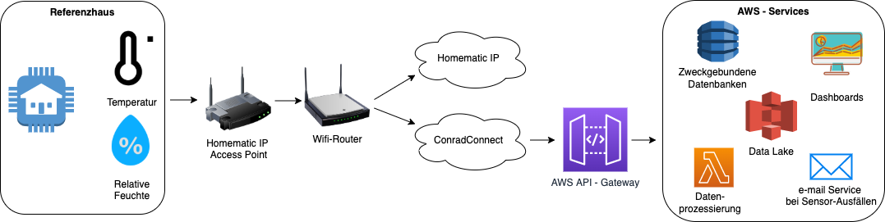

In our research project [Smart Air](https://www.esentri.com/smart-air-intelligente-system-behaglichkeit-haus/) we were forced to get rid of [Conrad Connect IoT platform](https://conradconnect.com/de). Why? To our annoyance they just shot it down - and announced the shut down just one month in advance! In this post I'll describe what had to be done to migrate to the open source [IoT platform iobroker](https://www.iobroker.net/) and why I'm actually happy about this forced IoT platform switching.

Our Starting Point
======
Within the research project [Smart Air](https://www.esentri.com/smart-air-intelligente-system-behaglichkeit-haus/) we are trying to develop an AI based control of a ventilation system with integrated dehumidification for residential houses. Therefore we collected and are still collecting data of a reference house with a standard ventilation system. This data is measured by serveral sensors from [Homematic IP](https://homematic-ip.com/de) placed in each room of the reference house as well as outside the house. As Homematic IP was partnering with Conrad Connect we did not really question which IoT platform would be the right one for our needs and just accepted the costs for Conrad Connect (round about 1000€ per year for our project size). We built the following infrastucture:

Migration steps towards iobroker
======

Step1
------

Step2
------

Advantages of iobroker over conrad connect
======

